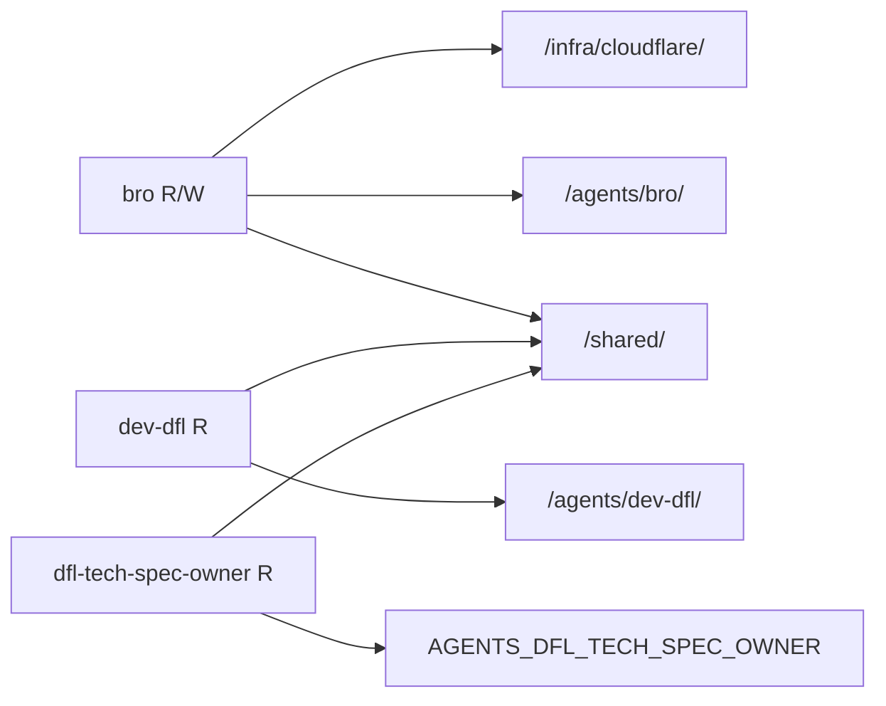

# Infisical Map Skill

Queries Infisical for all machine identities in the project, discovers the folder
tree, maps identities to their accessible secret paths, and emits a Mermaid diagram.
The diagram can be sent directly to Telegram or printed to stdout.

## When to use

Run this skill when you need to:
- Audit which agents have access to which secret paths.
- Visualise the current credential architecture for Tainan or the team.
- Debug a "secret not found" situation by confirming what paths an identity can reach.

## Prerequisites

The calling agent must have **admin or member role** in the Infisical project to list
project identities.  Bro (`tainan__bro__openclaw`) has R/W and satisfies this.

| Var | Description |
|-----|-------------|
| `INFISICAL_CLIENT_ID` | Universal Auth client ID (Bro's R/W identity) |
| `INFISICAL_CLIENT_SECRET` | Universal Auth client secret |

Optional:

| Var | Default | Description |
|-----|---------|-------------|
| `INFISICAL_API_URL` | `https://infisical.devfellowship.com` | Infisical server |
| `INFISICAL_PROJECT_ID` | `f9572f70-c99d-4a44-8686-e9e83ff5a8fe` | personal-vaults-tainan |
| `INFISICAL_ENV` | `prod` | Environment slug |
| `TELEGRAM_BOT_TOKEN` | — | Bot token; if unset, output goes to stdout only |
| `TELEGRAM_CHAT_ID` | — | Chat or user ID to send the diagram to |

## How it works

1. **Authenticate** — Universal Auth login → short-lived `accessToken`.
2. **List identities** — `GET /api/v2/workspace/{projectId}/identities` returns all
   machine identity memberships with their role (`admin`, `member`, `viewer`).
3. **Discover paths** — `GET /api/v1/folders` recursively walks the folder tree.
4. **Map access** — each identity is matched to paths by naming convention:
   - `/agents/{agent-name}/` — agent-specific secrets (derived from identity name)
   - `/shared/` — every identity gets read access
   - `/infra/**` — admin/member identities only (Bro)
5. **Generate Mermaid** — `graph LR` with identity nodes → path nodes.
6. **Send** — posts to Telegram as a code block, or prints to stdout.

## Usage

```bash
python3 skills/infisical-map/map.py
```

Or with explicit vars:

```bash
INFISICAL_CLIENT_ID="..." \
INFISICAL_CLIENT_SECRET="..." \
TELEGRAM_BOT_TOKEN="..." \
TELEGRAM_CHAT_ID="6649275560" \
python3 skills/infisical-map/map.py
```

## Example output



## Infisical identity → agent-name mapping

Identities follow the pattern `{owner}__{agent-name}__{platform}`.
The middle segment is extracted and matched against `/agents/{agent-name}/`.

| Identity name | Agent path |
|---------------|------------|
| `tainan__bro__openclaw` | `/agents/bro/` |
| `tainan__dev-dfl__paperclip` | `/agents/dev-dfl/` |
| `tainan__dfl-tech-spec-owner__paperclip` | `/agents/dfl-tech-spec-owner/` |
| `tainan__dfl-rollout-ops__paperclip` | `/agents/dfl-rollout-ops/` |
| `tainan__dfl-single-repo-impl__paperclip` | `/agents/dfl-single-repo-impl/` |
| `tainan__dfl-verifier__paperclip` | `/agents/dfl-verifier/` |

## Troubleshooting

| Symptom | Cause | Fix |
|---------|-------|-----|
| `401 Unauthorized` on identity list | Bro's identity is not admin/member | Promote identity to member in Infisical project settings |
| Empty identity list | Token lacks project access | Confirm `INFISICAL_CLIENT_ID` belongs to the correct project |
| No paths discovered | No folders created yet | Provision secrets first — Infisical creates folders on first secret write |
| Telegram not sending | `TELEGRAM_BOT_TOKEN` or `TELEGRAM_CHAT_ID` missing | Set vars or use stdout mode |

## Project details

- Server: `https://infisical.devfellowship.com`
- Project: `personal-vaults-tainan` (id: `f9572f70-c99d-4a44-8686-e9e83ff5a8fe`)
- Environment: `prod`
- Auth method: Universal Auth (2 h TTL)
